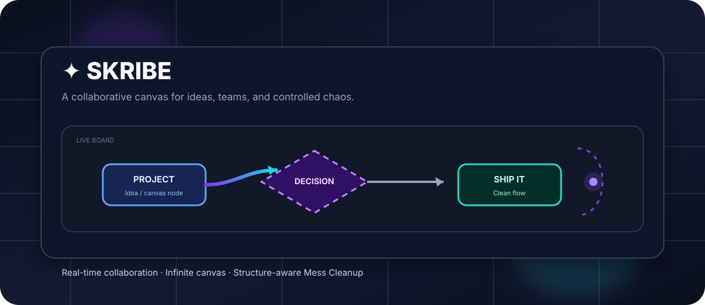
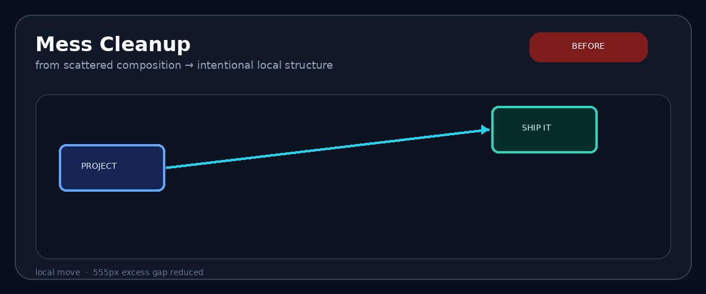
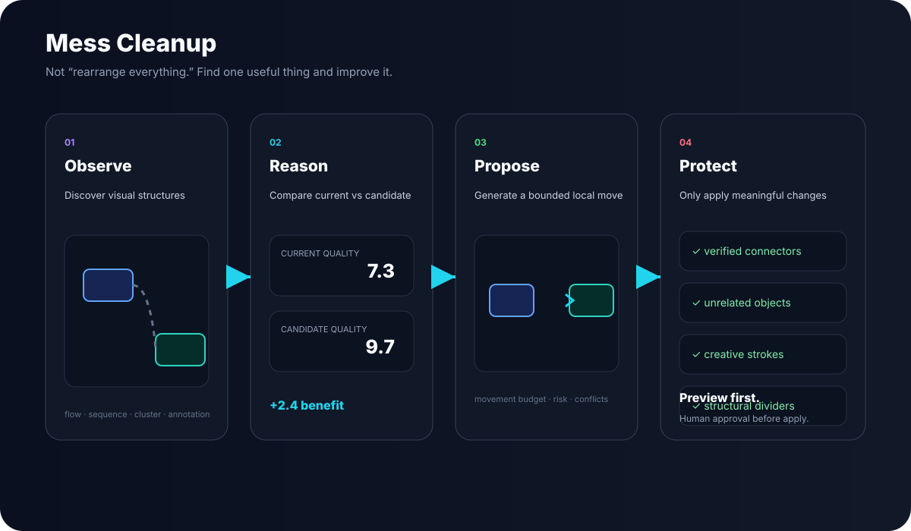
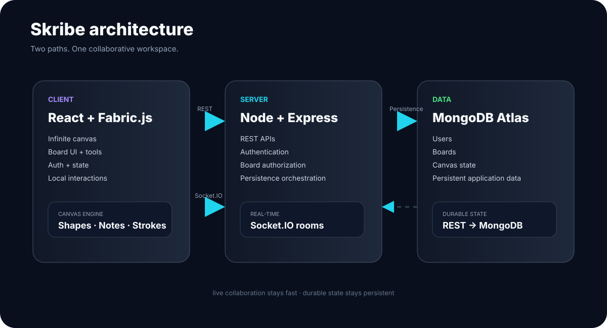

 

✦ Skribe

Think visually. Build together.

A real-time collaborative infinite whiteboard for teams to
<strong>think, sketch, connect, and build ideas together.</strong>

 

<a href="#-why-skribe">Why Skribe</a>
  ·  
<a href="#-live-collaboration">Collaboration</a>
  ·  
<a href="#-mess-cleanup">Mess Cleanup</a>
  ·  
<a href="#-architecture">Architecture</a>
  ·  
<a href="#-getting-started">Get Started</a>

  

🎬 See the idea

  

A blank canvas is easy. Making it useful together is the hard part.

✦ Why Skribe?

Most collaboration tools force a choice:

structured productivity or the freedom of a blank canvas.

Skribe is built around the idea that you should get both.

Start messy.
Draw freely.
Move things around.
Connect ideas.
Collaborate live.

Then, when a local part of the canvas genuinely needs help, Skribe can reason about its structure instead of blindly rearranging the entire board.

Chaos → Collaboration → Structure

🎨 The Canvas

<table>
<tr>
<td width="33%" align="center">

∞

Infinite

No fixed page.
No artificial boundaries.

</td>
<td width="33%" align="center">

✎

Expressive

Draw, sketch, annotate, connect, erase.

</td>
<td width="33%" align="center">

◎

Interactive

Objects aren't pixels.
They're editable canvas elements.

</td>
</tr>
</table>

Create

Freehand strokes · Shapes · Sticky notes · Text · Connectors

Navigate

Pan · Zoom · Undo / Redo · Infinite workspace

Interact

Eraser · Laser pointer · Property controls · Stroke controls

👥 Live Collaboration

Skribe is built as a collaborative application from the inside out.

flowchart LR
    A[👤 User] --> B[React + Fabric.js]
    B --> C{Socket.IO}
    C --> D[Board Room]
    D --> E[👥 Other Users]
    D --> F[Presence]
    D --> G[Object Sync]
    D --> H[Drawing / Eraser / Laser]

What stays live?

Interaction

Synchronized

Canvas objects

✅

Freehand drawing

✅

Eraser actions

✅

Laser pointer

✅

Presence

✅

Join / leave

✅

Reconnection

✅

Duplicate-event protection

✅

Underneath that real-time layer:

Authentication → Authorization → Board Rooms → Persistence

🧠 Mess Cleanup

Not an auto-layout button.

Mess Cleanup asks a more interesting question:

What would a human reasonably consider messy here — and what is the smallest high-confidence change that would make it better?

  

The flow

Workspace Model
       ↓
Semantic Scene
       ↓
Visual Structure Discovery
       ↓
Current Composition
       ↓
Candidate Composition
       ↓
Benefit × Confidence − Cost − Risk
       ↓
Cleanup Plan
       ↓
Preview
       ↓
Human Approval
       ↓
Apply

It can recognize

Flow · Sequence · Cluster · Annotation · Concept Group

It deliberately protects

Creative strokes · Structural dividers · Unrelated objects · Ambiguous connectors

🛡️ The rules are intentionally conservative

<table>
<tr>
<td>

✅ Improve

Meaningful local composition

Excessive spacing

Alignment

Flow readability

Branch / merge structure

Verified connector relationships

</td>
<td>

🚫 Never invent

Connector topology

Semantic relationships

Global layouts

Intentional creative structure

Ownership of unrelated objects

</td>
</tr>
</table>

Local beats global.
Intent beats proximity.
Preservation beats aggression.
Preview beats surprise.
Geometry beats assumptions.

🏗️ Architecture

  

Two communication paths

                  SKRIBE
                    │
          ┌─────────┴─────────┐
          │                   │
       DURABLE              LIVE
          │                   │
        REST                Socket.IO
          │                   │
      Express             Board Rooms
          │                   │
       MongoDB          Presence + Sync

This separation keeps persistent application state and low-latency collaboration concerns distinct.

🔐 Built Like a Real Application

Authentication

JWT · HTTP-only cookies · Protected routes · Google OAuth

Authorization

Board ownership · Collaborator access · Board-level permissions · Authenticated sockets

Persistence

Debounced autosave · Canvas restoration · Save-on-unmount · Page unload persistence

Collaboration

Room membership · Object synchronization · Presence · Reconnect · Disconnect handling

🧩 Tech Stack

  

Layer

Technologies

Frontend

React · Vite · Fabric.js · Tailwind CSS

Motion

GSAP · Anime.js

Realtime

Socket.IO

Backend

Node.js · Express.js

Database

MongoDB · Mongoose · MongoDB Atlas

Auth

JWT · Passport.js · Google OAuth

Development

JavaScript · REST · WebSockets · Git · GitHub

🔬 Engineering Focus

Skribe crosses several systems that each have different correctness requirements:

Canvas interaction
       │
       ▼
Fabric object model
       │
       ▼
Geometry normalization
       │
       ▼
Persistence
       │
       ▼
Real-time synchronization
       │
       ▼
Authentication / Authorization
       │
       ▼
Visual composition

For Mess Cleanup in particular, correctness is not:

“Did an action execute?”

It is:

Candidate selected
      ↓
Actual geometry changed
      ↓
Visible improvement exists
      ↓
Change stays local
      ↓
Unrelated content stays untouched

🧪 Validation

Mess Cleanup is validated across multiple layers:

             ┌────────────────────┐
             │   Unit Tests       │
             └─────────┬──────────┘
                       ↓
             ┌────────────────────┐
             │ Geometry / Topology│
             └─────────┬──────────┘
                       ↓
             ┌────────────────────┐
             │ Composition Tests  │
             └─────────┬──────────┘
                       ↓
             ┌────────────────────┐
             │ Real-board Eval    │
             └─────────┬──────────┘
                       ↓
             ┌────────────────────┐
             │ Browser Validation │
             └────────────────────┘

The system explicitly verifies:

actual candidate geometry

topology safety

preservation of unrelated objects

creative/divider protection

zero-change candidates

browser-visible improvements

📐 Project Structure

Skribe/
│
├── client/
│   ├── src/
│   │   ├── features/
│   │   │   └── messCleanup/
│   │   ├── components/
│   │   ├── pages/
│   │   └── utils/
│   │
│   ├── scripts/
│   └── ...
│
├── server/
│   ├── routes/
│   ├── models/
│   ├── middleware/
│   ├── sockets/
│   └── ...
│
├── docs/
│   └── assets/
│       ├── skribe-hero.svg
│       ├── mess-cleanup.gif
│       ├── mess-cleanup-pipeline.svg
│       ├── skribe-architecture.svg
│       └── stack.svg
│
├── package.json
└── README.md

⚡ Getting Started

git clone <your-repository-url>
cd Skribe

npm install
npm run dev

Then open the local development URL printed by Vite.

Keep the exact environment-variable names and production commands synchronized with the current project configuration.

🖼️ Recommended GitHub README layout

Once you add real screenshots, put the strongest visual material near the top:

                 ┌───────────────────────┐
                 │     HERO / DEMO       │
                 └───────────────────────┘

        ┌────────────────┐   ┌────────────────┐
        │   COLLABORATE  │   │   MESS CLEANUP │
        │    SCREENSHOT  │   │ BEFORE → AFTER │
        └────────────────┘   └────────────────┘

Best assets to add:

docs/screenshots/collaboration.png
docs/screenshots/mess-cleanup-before.png
docs/screenshots/mess-cleanup-after.png
docs/demo.gif

💭 The idea behind the project

A whiteboard should be allowed to become messy.

That's where ideas happen.

The interesting problem isn't forcing every object into a perfect grid.

It's building a canvas that can handle:

chaos → collaboration → structure

without taking away the freedom that made the canvas useful in the first place.

✦ Skribe

A canvas for ideas. A workspace for teams.

 

Think together.    Sketch together.    Build together.

  

Built with React · Fabric.js · Node.js · Socket.IO · MongoDB

